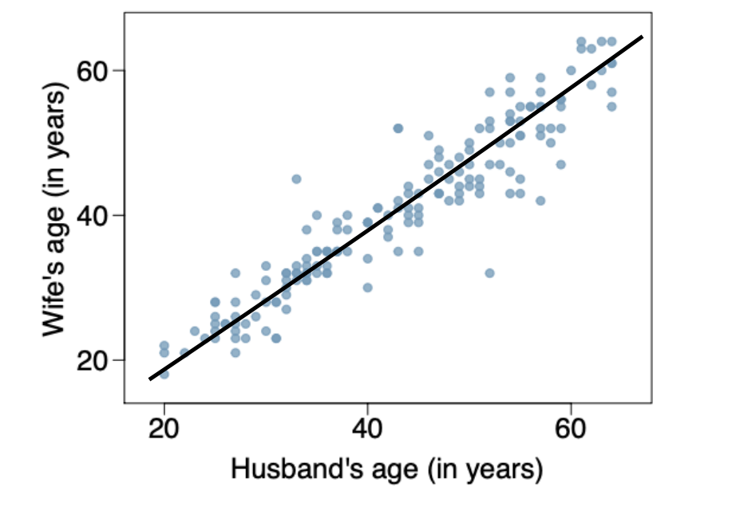

```{r}
#| echo: false
#| 
library(readxl)
```

# Problem 1

## a.)

Explanatory variable -> Husband's age (in years)
Response variable -> Wife's age (in years)

## b.)

There is a postive relationship between these variables. As the Husband's age increases the Wife's age increases as well

## c.)

{width=60%}

## d.)

To estimate the slope I chose two point closest to the line of best fit

$(37,38)$ and $(41,40)$

```{r}
(40-38) / (41-37)
```
The Estimated slope is $m = 0.5$


# Problem 2

## a.)

Explanatory Variable -> Family Income
Response Variable -> Gift Aid from university

## b.)

$(71000, 21000)$ and $(60000, 22000)$

```{r}
(22000 - 21000) / (60000 - 71000)
```

$m = 12000$


\newpage
# Problem 3

```{r}
garbage_weight <- read_excel("garbage_weight.xlsx")
```
## a.)
```{r}
cor(garbage_weight$METAL, garbage_weight$PLASTIC)
```

## b.)
```{r}
lm(garbage_weight$PLASTIC ~ garbage_weight$METAL)
```
$garbage\_weight\$PLASTIC = 0.641 + 0.573garbage\_weight\$METAL$

## c.)
For every 1 unit of metal waste, we expect the amount of plastic waste to increase by 0.573 unit, on average.

\newpage
## d.)
```{r}
metal_obs <- 2.11
plastic_actual <- 4.69

plastic_pred <- 0.641 + 0.573 * metal_obs

residual <- plastic_actual - plastic_pred

plastic_pred 
residual     
```


# Problem 4

```{r}
pokemon_sample <- read_excel("pokemon_sample.xlsx")
```

## a.)
```{r}
cor(pokemon_sample$Speed, pokemon_sample$Attack)
```

## b.)
```{r}
lm(pokemon_sample$Attack ~ pokemon_sample$Speed)
```

$pokemon\_sample\$Attack = 50.187 + 0.493pokemon\_sample\$Speed$

## c.) 
For every 1 unit of Speed a Pokemon has, we expect its Attack  to increase by approximately 0.493 points, on average.

## d.)
```{r}
speed_obs <- 150
attack_actual <- 100

attack_pred <- 50.187 + 0.493 * speed_obs

residual <- attack_actual - attack_pred

attack_pred 
residual       
```

